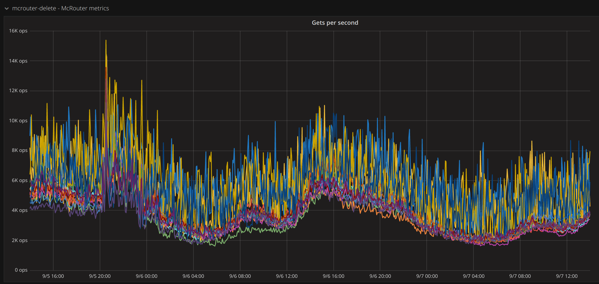
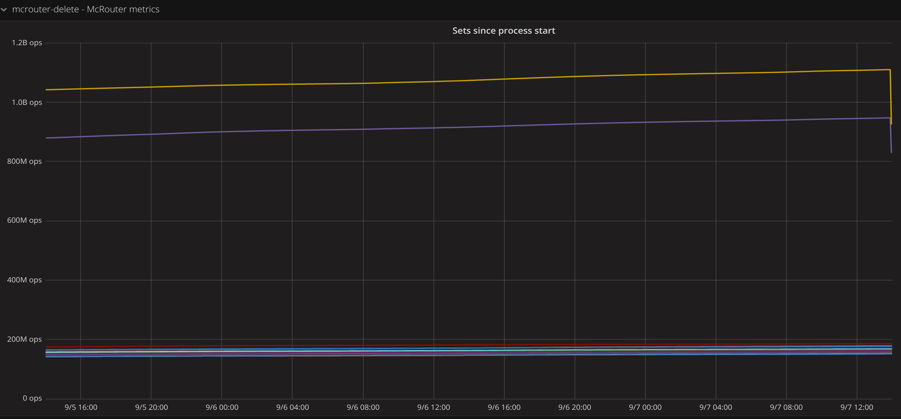

# collectd-mcrouter
A [collectd](http://collectd.org/) plugin that collects metrics from [Mcrouter](https://github.com/facebook/mcrouter) stats file. 
It runs under collectd [Python plugin](http://collectd.org/documentation/manpages/collectd-python.5.shtml).

McRouter automatically creates and updates several files useful to monitor it's state, which is by default created under [`/var/mcrouter/stats`](https://github.com/facebook/mcrouter/wiki/Stats-files).
More information on stats list [here](https://github.com/facebook/mcrouter/wiki/Stats-list).

This directory consolidates all the metadata associated with the McRouter collectd plugin. 
The relevant code for the plugin can be found [here](https://github.com/Radha13/collectd-mcrouter)

## Requirements
|Software | version|
|---------|---------|
|Collectd | 4.9 or later (for the python plugin)|
|Python   | 2.6 or later |


## Install

1. Copy [mcrouter_stats.py](https://github.com/Radha13/collectd-mcrouter/blob/master/mcrouter_stats.py) somewhere accessible by collectd, e.g `/usr/share/collectd/collectd-mcrouter`.
1. Create a collectd configuration file (e.g `mcrouter_stats.conf`) for the plugin preferably in `/etc/collectd/managed_config/` (see the example below).
1. Restart collectd.

## Sample configuration

```
<LoadPlugin python>
        Globals true
</LoadPlugin>

<Plugin python>
        # mcrouter_stats.py is at "/usr/share/collectd/collectd-mcrouter/mcrouter_stats.py"
        ModulePath "/usr/share/collectd/collectd-mcrouter"
        Interactive false
        Import "mcrouter_stats"
        <Module "mcrouter_stats">
                Port <mcrouter_port_number>
                # McRouter exposes metrics in "/var/mcrouter/stats"
                DataDir "/path/to/mcrouter/stats/file"
        </Module>
</Plugin>
```
### Dashboard
* Gets per second


* Sets since process start

